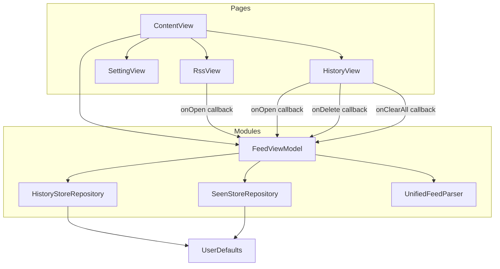
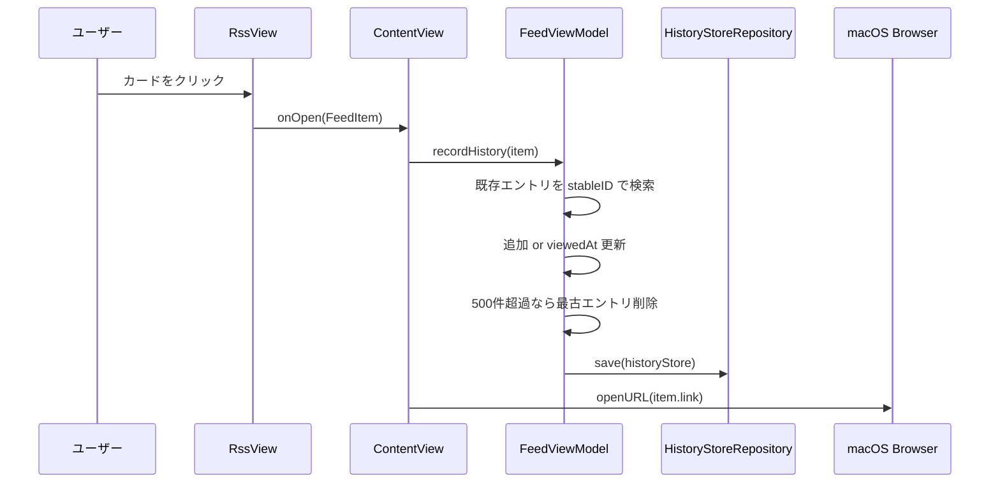
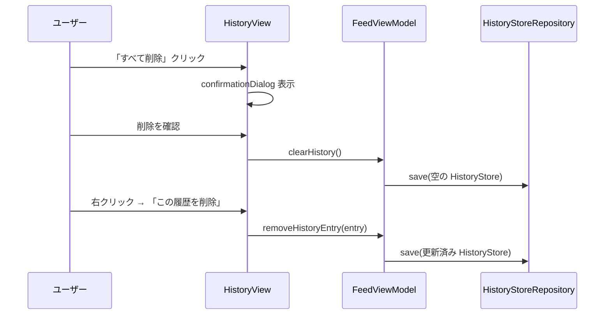
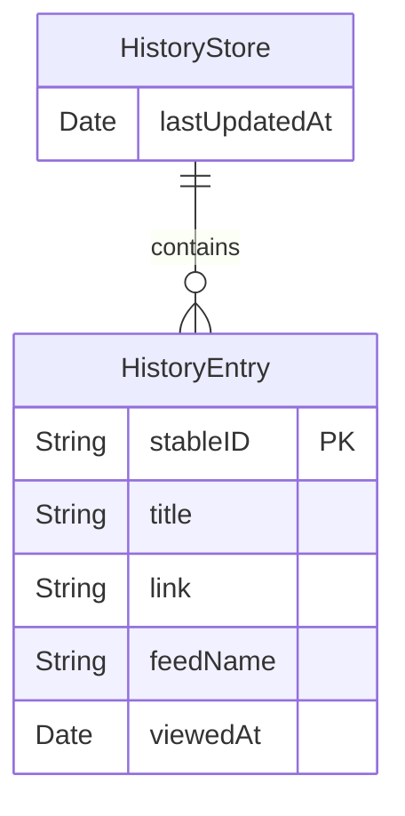

# Design Document: browsing-history-screen

## Overview

**Purpose**: RssFeedReader macOS アプリに閲覧履歴画面を追加し、ユーザーが過去に開いた RSS 記事を時系列で確認・再アクセスできるようにする。

**Users**: macOS アプリを使用して複数フィードを横断閲覧する開発者・ユーザーが、「以前読んだ記事をもう一度開きたい」という操作を最小ステップで実現する。

**Impact**: 既存 TabView に「履歴」タブを追加し、記事タップ時のコールバックに履歴記録処理を接続する。`FeedViewModel` に履歴状態・操作を追加し、`SeenStoreRepository` と対称な `HistoryStoreRepository` を新設する。

### Goals
- 記事クリック時に自動で `HistoryEntry` を記録し、UserDefaults に永続化する
- `HistoryView` で閲覧日時降順のリストを表示し、エントリから直接記事を再オープンできる
- 全削除・個別削除によりプライバシー管理を可能にする

### Non-Goals
- サーバーサイドでの履歴同期・バックアップ
- フィード横断での検索・フィルタリング機能
- 閲覧時間の計測やアナリティクス
- iCloud 連携

---

## Requirements Traceability

| Requirement | Summary | Components | Interfaces | Flows |
|-------------|---------|------------|------------|-------|
| 1.1 | 記事クリック時に HistoryEntry を保存 | HistoryStoreRepository, FeedViewModel | `recordHistory(_:)` | 記事オープンフロー |
| 1.2 | viewedAt を ISO 8601 タイムスタンプで記録 | HistoryEntry | `viewedAt: Date` | — |
| 1.3 | 同一記事の重複記録を防ぎ最新日時で更新 | FeedViewModel | `recordHistory(_:)` | — |
| 1.4 | UserDefaults `"history-store.v1"` キーで永続化 | HistoryStoreRepository | `save(_:)` | — |
| 1.5 | 最大500件・超過時は古い順削除 | FeedViewModel | `recordHistory(_:)` | — |
| 2.1 | 閲覧日時降順でリスト表示 | HistoryView | `historyEntries: [HistoryEntry]` | — |
| 2.2 | 0件時は空状態メッセージ表示 | HistoryView | — | — |
| 2.3 | 各エントリにタイトル・フィード名・閲覧日時を表示 | HistoryView | — | — |
| 2.4 | 閲覧日時を `YYYY/MM/DD HH:mm` 形式で表示 | HistoryView | — | — |
| 2.5 | ロード中インジケーター表示 | HistoryView | — | — |
| 3.1 | エントリクリックでブラウザ開く | HistoryView | `onOpen: (HistoryEntry) -> Void` | 履歴再オープンフロー |
| 3.2 | 再クリック時に viewedAt を更新し先頭へ移動 | FeedViewModel | `recordHistoryEntry(_:)` | — |
| 3.3 | 無効URLのエントリはクリック不可表示 | HistoryView | — | — |
| 4.1 | TabView に「履歴」タブを追加 | ContentView | `enum tab` | — |
| 4.2 | タブアイコンに SF Symbols `clock` を使用 | ContentView | — | — |
| 4.3 | タブ切り替え時に最新データを表示 | HistoryView | `historyEntries` (Published) | — |
| 5.1 | 「すべて削除」ボタンを提供 | HistoryView | `onClearAll: () -> Void` | — |
| 5.2 | 全削除前に確認ダイアログを表示 | HistoryView | — | — |
| 5.3 | 右クリックコンテキストメニューで個別削除 | HistoryView | `onDelete: (HistoryEntry) -> Void` | — |
| 5.4 | 個別削除で該当エントリのみ削除し画面を更新 | FeedViewModel | `removeHistoryEntry(_:)` | — |
| 5.5 | 全削除後に `"history-store.v1"` が空配列で保存される | HistoryStoreRepository | `save(_:)` | — |

---

## Architecture

### Existing Architecture Analysis

現在の TabView 構成:
- `ContentView` が `FeedViewModel` を `@StateObject` で所有
- `RssView`・`SettingView` へデータと非同期コールバックを props として渡す（props drilling）
- `SeenStoreRepository` が UserDefaults + JSONEncoder/Decoder でデータを永続化する基本パターンを提供

変更による影響:
- `ContentView.swift`: `enum tab` に `.history` 追加、TabView に `HistoryView` エントリ追加
- `FeedViewModel.swift`: 履歴状態・操作メソッドの追加
- `RssView.swift`: `onOpen: (FeedItem) -> Void` コールバックの追加

### Architecture Pattern & Boundary Map



**Architecture Integration**:
- Selected pattern: MVVM + Repository（既存パターンの踏襲）
- Domain boundaries: `Modules/` にビジネスロジック・永続化、`Pages/` に表示のみ
- Existing patterns preserved: props drilling、`@MainActor final class`、UserDefaults 永続化、`#Preview` 必須
- New components rationale: `HistoryEntry`（値型モデル）、`HistoryStore`（Codable 集約）、`HistoryStoreRepository`（永続化担当）、`HistoryView`（表示層）
- Steering compliance: tech.md「Root ViewにのみViewModelを@StateObjectで生成」を遵守し、`HistoryView` 専用 ViewModel は作らない

### Technology Stack

| Layer | Choice / Version | Role in Feature | Notes |
|-------|------------------|-----------------|-------|
| UI | SwiftUI (macOS 14+) | `HistoryView` のレイアウト、List・confirmationDialog | 既存スタック |
| State | Combine / @Published | `historyEntries` の変更を HistoryView へ通知 | FeedViewModel 拡張 |
| Persistence | UserDefaults + JSONEncoder/Decoder | HistoryStore の永続化 | `"history-store.v1"` キー |
| Concurrency | @MainActor | FeedViewModel の状態更新を メインスレッドで保証 | 既存スタック |

---

## System Flows

### 記事オープン・履歴記録フロー



### 履歴削除フロー



---

## Components and Interfaces

### Components Summary

| Component | Domain/Layer | Intent | Req Coverage | Key Dependencies | Contracts |
|-----------|--------------|--------|--------------|------------------|-----------|
| HistoryEntry | Modules / Model | 1件分の閲覧履歴を表す値型 | 1.1, 1.2 | — | State |
| HistoryStore | Modules / Model | HistoryEntry の集合を Codable で保持 | 1.4, 1.5 | HistoryEntry | State |
| HistoryStoreRepository | Modules / Repository | UserDefaults への load/save | 1.4, 5.5 | UserDefaults | Service |
| FeedViewModel (拡張) | Modules / ViewModel | 履歴状態管理・操作メソッド追加 | 1.1–1.5, 3.2, 5.4 | HistoryStoreRepository | Service, State |
| HistoryView | Pages / View | 閲覧履歴の一覧表示・操作UI | 2.1–2.5, 3.1, 3.3, 4.1, 5.1–5.3 | FeedViewModel | — |
| ContentView (拡張) | App / Entry | タブ追加・コールバック接続 | 4.1, 4.2 | FeedViewModel, HistoryView | — |
| RssView (拡張) | Pages / View | onOpen コールバック追加 | 1.1 | — | — |

---

### Modules / Model

#### HistoryEntry

| Field | Detail |
|-------|--------|
| Intent | 1件の閲覧履歴を表す Codable 値型 |
| Requirements | 1.1, 1.2, 2.3 |

**Responsibilities & Constraints**
- `stableID` をプライマリキーとして重複検出に使用する
- `viewedAt` は UTC で記録し、表示時にローカルタイムゾーンで整形する
- 不変フィールド（`stableID`, `title`, `link`, `feedName`）と可変フィールド（`viewedAt`）を区別する

**Contracts**: State [x]

##### State Management

```swift
struct HistoryEntry: Identifiable, Codable, Hashable {
    var id: String { stableID }
    let stableID: String      // FeedItem.stableID（空なら link）
    let title: String
    let link: String
    let feedName: String      // FeedItem.siteTitle のフォールバック込み
    var viewedAt: Date
}
```

- State model: 値型。FeedViewModel 内の配列要素として管理
- Persistence: `HistoryStore` 経由で UserDefaults に JSON シリアライズ
- Concurrency: `@MainActor` な FeedViewModel 上でのみ変異

**Implementation Notes**
- Integration: `FeedItem` から `HistoryEntry` を生成する際、`siteTitle` が空の場合は `formatSiteTitleFallback()` を使用する
- Validation: `stableID` が空の場合は `link` を代替として使用（FeedViewModel 既存ロジックと同じ）

---

#### HistoryStore

| Field | Detail |
|-------|--------|
| Intent | HistoryEntry の配列を Codable でラップする集約モデル |
| Requirements | 1.4, 1.5 |

**Responsibilities & Constraints**
- エントリは `viewedAt` 降順（先頭が最新）で管理する
- 最大件数を 500 件とし、超過時は配列末尾（最古）から削除する

**Contracts**: State [x]

##### State Management

```swift
struct HistoryStore: Codable {
    var entries: [HistoryEntry] = []
    var lastUpdatedAt: Date = .init()
}
```

---

### Modules / Repository

#### HistoryStoreRepository

| Field | Detail |
|-------|--------|
| Intent | `HistoryStore` を UserDefaults に永続化する責務を持つ Repository |
| Requirements | 1.4, 5.5 |

**Responsibilities & Constraints**
- UserDefaults キー `"history-store.v1"` を使用する
- デコードに失敗した場合は空の `HistoryStore` を返す（フェイルセーフ）

**Dependencies**
- Outbound: `UserDefaults.standard` — JSON データの読み書き (P0)

**Contracts**: Service [x]

##### Service Interface

```swift
final class HistoryStoreRepository {
    func load() -> HistoryStore
    func save(_ store: HistoryStore)
}
```

- Preconditions: `save` は有効な `HistoryStore` を受け取る
- Postconditions: `save` 後に `load` すると同一データが返る
- Invariants: デコード失敗時は `HistoryStore()` を返し、例外を外部に伝播しない

---

### Modules / ViewModel

#### FeedViewModel（履歴機能拡張）

| Field | Detail |
|-------|--------|
| Intent | `historyEntries` 状態の管理と履歴操作メソッドの提供 |
| Requirements | 1.1, 1.3, 1.4, 1.5, 3.2, 5.4 |

**Responsibilities & Constraints**
- `historyEntries` は `@Published` で公開し、`HistoryStore.entries` を直接参照する
- 履歴の操作（追加・削除）後に必ず `historyRepo.save()` を呼ぶ
- 500件上限は `recordHistory` メソッド内で保証する

**Dependencies**
- Inbound: `ContentView` — `recordHistory`・`clearHistory`・`removeHistoryEntry` の呼び出し (P0)
- Outbound: `HistoryStoreRepository` — load/save (P0)

**Contracts**: Service [x], State [x]

##### Service Interface

```swift
extension FeedViewModel {
    // 初期化時に追加するプロパティ
    // @Published private(set) var historyEntries: [HistoryEntry]
    // private let historyRepo: HistoryStoreRepository
    // private var historyStore: HistoryStore

    func recordHistory(_ item: FeedItem)
    // - stableID が既存エントリと一致する場合は viewedAt を更新し先頭に移動する
    // - 新規エントリは先頭に挿入する
    // - 挿入後に entries.count > 500 なら末尾を削除する
    // - historyRepo.save(historyStore) を呼ぶ

    func removeHistoryEntry(_ entry: HistoryEntry)
    // - entries から entry.stableID が一致するものを削除する
    // - historyRepo.save(historyStore) を呼ぶ

    func clearHistory()
    // - entries を空配列にリセットする
    // - historyRepo.save(空の HistoryStore) を呼ぶ
}
```

- Preconditions: `recordHistory` は有効な `FeedItem`（stableID または link が非空）を受け取る
- Postconditions: `clearHistory` 後は `historyEntries` が空配列になる
- Invariants: すべての操作は `@MainActor` コンテキストで実行される

**Implementation Notes**
- Integration: `init()` 内で `historyStore = historyRepo.load()` し `historyEntries = historyStore.entries` を初期化する
- Risks: FeedViewModel が肥大化するが、既存の seenRepo と対称な構造を保つため許容する（research.md 参照）

---

### Pages / View

#### HistoryView

| Field | Detail |
|-------|--------|
| Intent | 閲覧履歴の一覧を表示し、再オープン・削除操作を提供する SwiftUI View |
| Requirements | 2.1, 2.2, 2.3, 2.4, 2.5, 3.1, 3.3, 4.1, 5.1, 5.2, 5.3 |

**Responsibilities & Constraints**
- データ表示のみ担当し、ビジネスロジックは持たない
- `historyEntries` が変更されると自動的に再描画される（`@Published` 経由）
- `#Preview` を末尾に必ず記述する

**Dependencies**
- Inbound: `ContentView` — `historyEntries`・コールバック群を受け取る (P0)

**Contracts**: State [x]

##### State Management

```swift
struct HistoryView: View {
    let historyEntries: [HistoryEntry]
    let onOpen: (HistoryEntry) -> Void
    let onDelete: (HistoryEntry) -> Void
    let onClearAll: () -> Void

    @State private var showClearConfirmation: Bool = false
    @Environment(\.openURL) private var openURL
}
```

**Implementation Notes**
- Integration: `List` + `ForEach` でエントリを表示。各行に `.contextMenu { Button("この履歴を削除") { onDelete(entry) } }` を付与する
- Validation: `entry.link` を `URL(string:)` でパースし、`nil` の場合はクリックを無効化する（3.3）
- 日時フォーマット: `DateFormatter` または `Date.formatted` を使用し `"yyyy/MM/dd HH:mm"` 形式で表示する（2.4）
- 全削除ボタン: ツールバーに配置し、`.confirmationDialog` で確認ダイアログを実装する（5.2）

---

### App / Entry

#### ContentView（タブ拡張）

Summary-only（新しい境界を導入しない UI 変更）

変更点:
- `enum tab` に `.history` を追加
- TabView に `HistoryView(historyEntries: vm.historyEntries, onOpen: { vm.recordHistory($0) ... }, ...)` エントリを追加
- タブアイコン: `Label("履歴", systemImage: "clock")`

#### RssView（コールバック追加）

Summary-only

変更点:
- `let onOpen: (FeedItem) -> Void` プロパティを追加
- `RssCardView` の `onTap` クロージャ内で `openURL(url)` に加えて `onOpen(item)` を呼ぶ
- `ContentView` で `onOpen: { vm.recordHistory($0) }` を接続する

---

## Data Models

### Domain Model

- **Aggregate Root**: `HistoryStore` — 全閲覧履歴エントリを管理する集約
- **Value Object**: `HistoryEntry` — 1件の閲覧履歴。`stableID` が自然キー
- **Business Rule**: 同一 `stableID` のエントリは1件のみ存在する。500件上限

### Logical Data Model



**Consistency & Integrity**:
- `stableID` の一意性は `FeedViewModel.recordHistory` 内で保証（既存エントリの検索・更新ロジック）
- 500件制限は `recordHistory` 呼び出しのたびに評価・適用

### Physical Data Model（UserDefaults / JSON）

**Key**: `"history-store.v1"`

**Value Schema** (JSON):
```json
{
  "entries": [
    {
      "stableID": "https://example.com/article-1",
      "title": "記事タイトル",
      "link": "https://example.com/article-1",
      "feedName": "Zenn",
      "viewedAt": "2026-02-20T10:00:00Z"
    }
  ],
  "lastUpdatedAt": "2026-02-20T10:00:00Z"
}
```

- `Date` は `JSONEncoder.dateEncodingStrategy = .iso8601` で ISO 8601 文字列としてエンコードする
- 最大サイズ目安: 500件 × 約200バイト = 約100KB（UserDefaults の上限 4MB 以内）

---

## Error Handling

### Error Strategy
UserDefaults 操作は失敗をサイレントに扱い、UI をブロックしない（既存パターンと一貫）。

### Error Categories and Responses

| エラーケース | 対応 |
|-------------|------|
| JSON デコード失敗（起動時） | `HistoryStore()` を返しデータ欠損とみなす（フェイルセーフ） |
| JSON エンコード失敗（保存時） | ログ出力のみ（`print("❌ ...")`)。既存パターンと同じ |
| 無効な記事 URL（3.3） | `URL(string:)` が `nil` の場合、エントリ行のタップを無効化 |
| 全削除キャンセル | `confirmationDialog` の「キャンセル」選択で何もしない |

### Monitoring
- エンコード失敗時は `print("❌ Failed to save history:", error)` でデバッグログを出力
- 本番モニタリング基盤はなし（外部依存ゼロの方針）

---

## Testing Strategy

### Unit Tests
1. `HistoryStoreRepository`: `save` → `load` のラウンドトリップが同一データを返す
2. `FeedViewModel.recordHistory`: 同一 `stableID` を2回記録すると `historyEntries.count` が増えず `viewedAt` が更新される
3. `FeedViewModel.recordHistory`: 501件目の記録で `historyEntries.count` が 500 を超えない
4. `FeedViewModel.clearHistory`: 実行後 `historyEntries` が空配列になる
5. `FeedViewModel.removeHistoryEntry`: 指定エントリのみ削除され他は残る

### Integration Tests
1. 記事タップ → `recordHistory` → `HistoryStoreRepository.save` → アプリ再起動後 `load` で履歴が復元される
2. `clearHistory` → `save` → `load` で空配列が返る

### UI Tests
1. `HistoryView` に0件の状態で「閲覧履歴はありません」が表示される
2. エントリをクリックするとブラウザが開く（`openURL` が呼ばれる）
3. 「すべて削除」クリックで確認ダイアログが表示される
