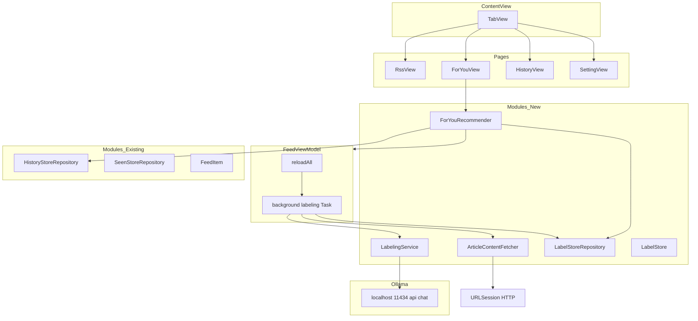
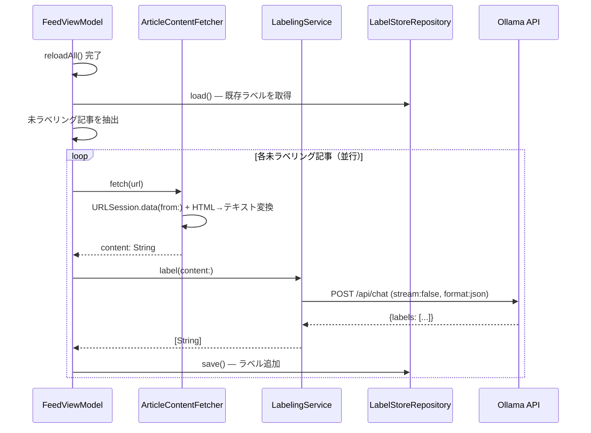
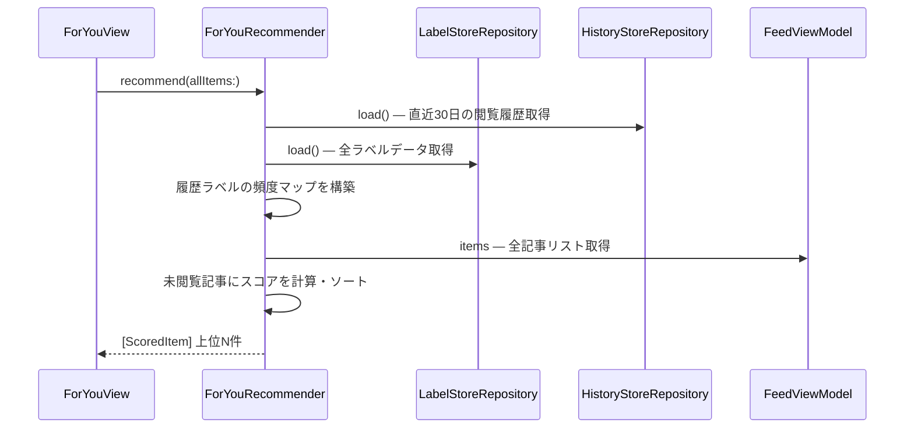

# Design Document: local-llm-article-labeling

---

## Overview

本機能は、macOS RSSフィードリーダーに「記事ラベリング」と「For You おすすめ」機能を追加する。

**Purpose**: RSS記事をローカルLLM（Ollama）で技術カテゴリに自動ラベリングし、閲覧履歴をもとにユーザーの興味に合った記事を「For You」タブで提示する。

**Users**: 技術ブログ・ニュースを横断閲覧する開発者ユーザーが、膨大なフィードから関心度の高い記事を効率よく発見するために利用する。

**Impact**: 既存の RSS / Settings / History タブ構成に For You タブを追加。記事フェッチ完了後のバックグラウンドラベリングパイプラインと、ラベル頻度スコアによるおすすめランキングを新設する。

### Goals

- RSS記事をローカルLLMで非同期ラベリングしUserDefaultsに永続化する
- 閲覧履歴のラベル頻度に基づきおすすめ記事を「For You」タブに表示する
- 既存のRSS閲覧体験（速度・UIレスポンス）を損なわない

### Non-Goals

- クラウドLLM（OpenAI等）の利用
- Ollama のインストール・モデルダウンロードを自動化するセットアップUI（将来課題）
- ラベリング結果の手動編集
- プッシュ通知・バッジ等の通知機能

---

## Architecture

### Existing Architecture Analysis

- **MVVM + Repository パターン**: `FeedViewModel`（`@MainActor final class`）が状態を一元管理し、ViewはPropsを受け取るだけ
- **永続化**: `UserDefaults` + `JSONEncoder`。`HistoryStoreRepository`（key: `history-store.v1`）と `SeenStoreRepository`（key: `seen-store.v1`）が確立済みパターン
- **並行処理**: `withTaskGroup` + `async/await`。`reloadAll()` でフィード並行取得が実装済み
- **タブ構成**: `ContentView` の `TabView`（RSS / Settings / History の3タブ）に1タブ追加

### Architecture Pattern & Boundary Map



**Architecture Integration**:
- 選択パターン: **既存MVVMパターン拡張 + 新規Serviceレイヤー追加**（Option B）
- 境界: `LabelingService` が Ollama API との通信を完全に隔離。`ArticleContentFetcher` がHTTPコンテンツ取得を担当
- 既存パターン維持: Repository（load/save）、`@MainActor` FeedViewModel、UserDefaults永続化
- 新規コンポーネント根拠: Ollama HTTP通信・HTMLパース・スコアリングは独立した責務であり FeedViewModel への混入を避ける
- ステアリング適合: 外部依存ゼロ（Ollamaはローカルサービス）、UserDefaults永続化、Swift Concurrency維持

### Technology Stack

| Layer | 選択 | 役割 | 備考 |
|-------|------|------|------|
| UI | SwiftUI（既存） | For You タブ・カード表示 | RssCardView 再利用 |
| ViewModel | Swift / @MainActor（既存） | ラベリングタスク起動 | FeedViewModel に最小追加 |
| LLM Service | URLSession → Ollama REST API | 記事テキストのラベリング | stream: false, format: json |
| LLM Model | llama3.2:3b（推奨）| テキスト分類 | ~2GB、8GB RAM対応 |
| コンテンツ取得 | URLSession（既存パターン） | 記事HTML取得 | 15秒タイムアウト |
| HTMLパース | 正規表現（Foundation） | プレーンテキスト抽出 | 先頭2000文字使用 |
| 永続化 | UserDefaults + JSONEncoder（既存） | ラベルデータ保存 | キー: article-labels.v1 |

---

## System Flows

### ラベリングパイプライン（バックグラウンド）



### For You スコアリングフロー



---

## Requirements Traceability

| Requirement | Summary | Components | Interfaces | Flows |
|-------------|---------|------------|------------|-------|
| 1.1 | RSS記事URL取得時に非同期コンテンツ取得 | ArticleContentFetcher | `fetch(url:)` | ラベリングパイプライン |
| 1.2 | 取得完了後ラベリング処理へ渡す | ArticleContentFetcher, LabelingService | `fetch→label` | ラベリングパイプライン |
| 1.3 | HTTP失敗時スキップ継続 | ArticleContentFetcher | エラー処理 | — |
| 1.4 | UI表示をブロックしない | FeedViewModel | background Task | ラベリングパイプライン |
| 1.5 | バックグラウンド非同期実行 | FeedViewModel | Task + async/await | — |
| 2.1 | Ollama APIへラベリングリクエスト送信 | LabelingService | `label(content:)` | ラベリングパイプライン |
| 2.2 | 定義済みラベルセットから選択 | LabelingService | ラベルフィルタリング | — |
| 2.3 | Ollama未起動時サイレントスキップ | LabelingService | エラー処理 | — |
| 2.4 | 未定義ラベルを無視 | LabelingService | バリデーション | — |
| 2.5 | 複数ラベル付与 | LabelingService, LabelStore | `[String]` | — |
| 3.1 | ラベル結果をUserDefaultsに保存 | LabelStoreRepository | `save(_:)` | — |
| 3.2 | 同URL上書き更新 | LabelStore, LabelStoreRepository | — | — |
| 3.3 | バージョン付きキー | LabelStoreRepository | key: article-labels.v1 | — |
| 3.4 | LabelStoreRepository が担当 | LabelStoreRepository | `load() / save()` | — |
| 3.5 | メモリキャッシュ | FeedViewModel | `@Published` state | — |
| 4.1 | reloadAll後にラベリングTask起動 | FeedViewModel | background Task | ラベリングパイプライン |
| 4.2 | UI操作をブロックしない | FeedViewModel | @MainActor分離 | — |
| 4.3 | ラベリング完了時データのみ更新 | FeedViewModel, LabelStoreRepository | — | — |
| 4.4 | 既ラベリング済みスキップ | FeedViewModel | スキップ判定 | ラベリングパイプライン |
| 4.5 | Swift Concurrency使用 | FeedViewModel | withTaskGroup | — |
| 5.1 | For You タブを ContentView に追加 | ContentView, ForYouView | TabItem | — |
| 5.2 | 閲覧ラベル頻度でスコアリング表示 | ForYouRecommender, ForYouView | `recommend(allItems:)` | For Youフロー |
| 5.3 | 閲覧履歴なし時ガイダンス表示 | ForYouView | 空状態UI | — |
| 5.4 | 記事タップでブラウザ開き既読記録 | ForYouView, FeedViewModel | openURL + recordHistory | — |
| 5.5 | 直近30日ラベル頻度でスコア算出 | ForYouRecommender | 頻度マップ算出 | For Youフロー |
| 5.6 | 既存RssCardView再利用 | ForYouView | RssCardView props | — |
| 6.1 | ラベルありでバッジ表示 | RssCardView（拡張） | labels prop | — |
| 6.2 | ラベルなしでレイアウト変更なし | RssCardView（拡張） | conditional rendering | — |
| 6.3 | 最大3件表示 | RssCardView（拡張） | prefix(3) | — |

---

## Components and Interfaces

### コンポーネント概要

| Component | Domain/Layer | Intent | Req Coverage | Key Dependencies | Contracts |
|-----------|--------------|--------|--------------|------------------|-----------|
| ArticleContentFetcher | Modules / Service | 記事URLからプレーンテキストを取得 | 1.1〜1.5 | URLSession (P0) | Service |
| LabelingService | Modules / Service | Ollama APIで記事をラベリング | 2.1〜2.5 | ArticleContentFetcher (P1), Ollama (P0) | Service, API |
| LabelStore | Modules / Model | ラベルデータのドメインモデル | 3.2〜3.3 | — | State |
| LabelStoreRepository | Modules / Repository | ラベルデータの永続化 | 3.1〜3.5 | UserDefaults (P0) | Service, State |
| FeedViewModel（拡張） | Modules / ViewModel | ラベリングタスク起動・キャッシュ | 4.1〜4.5 | LabelStoreRepository (P0), ArticleContentFetcher (P0), LabelingService (P0) | State |
| ForYouRecommender | Modules / Service | ラベル頻度スコアリング | 5.2, 5.5 | LabelStoreRepository (P0), HistoryStoreRepository (P0) | Service |
| ForYouView | Pages / View | For You タブUI | 5.1〜5.6 | ForYouRecommender (P0), FeedViewModel (P0), RssCardView (P1) | — |
| RssCardView（拡張） | Pages / View | ラベルバッジ表示を追加 | 6.1〜6.3 | — | — |
| ContentView（拡張） | App / View | For You タブをTabViewに追加 | 5.1 | ForYouView (P0) | — |
| FeedItem（拡張） | Modules / Model | labelsフィールド追加 | 2.5, 3.5 | — | State |

---

### Modules / Service

#### ArticleContentFetcher

| Field | Detail |
|-------|--------|
| Intent | 記事URLのHTMLを取得してプレーンテキストに変換する |
| Requirements | 1.1, 1.2, 1.3, 1.4, 1.5 |

**Responsibilities & Constraints**
- URLSession を使いHTTPでHTML取得（15秒タイムアウト）
- 正規表現でHTMLタグを除去しプレーンテキスト化
- 先頭2000文字を返却（LLMトークン節約）
- エラー時は `ArticleContentFetcherError` をスロー

**Dependencies**
- Outbound: `URLSession.shared` — HTTP取得 (P0)

**Contracts**: Service [x]

##### Service Interface
```swift
enum ArticleContentFetcherError: Error {
    case httpError(statusCode: Int)
    case timeout
    case emptyContent
}

protocol ArticleContentFetchable {
    func fetch(url: URL) async throws -> String
}

final class ArticleContentFetcher: ArticleContentFetchable {
    func fetch(url: URL) async throws -> String
}
```
- Preconditions: `url` は有効なHTTPSまたはHTTP URL
- Postconditions: 先頭2000文字以内のプレーンテキストを返す
- Invariants: メインスレッドをブロックしない

**Implementation Notes**
- Integration: `URLRequest` に15秒タイムアウトを設定。`HTTPURLResponse` のステータスコード200-299チェック
- Validation: 取得テキストが空の場合 `.emptyContent` をスロー
- Risks: 一部サイトがBot UA をブロックする可能性。デフォルトUserAgent使用

---

#### LabelingService

| Field | Detail |
|-------|--------|
| Intent | Ollama API に記事テキストを送り、定義済みラベルセットから該当ラベルを返す |
| Requirements | 2.1, 2.2, 2.3, 2.4, 2.5 |

**Responsibilities & Constraints**
- `POST http://localhost:11434/api/chat` へJSON送信（stream: false, format: json）
- システムプロンプトにラベルセット定義を含める
- レスポンスJSONをパースし、定義済みラベルセットとの差集合でフィルタリング
- Ollama 未起動・タイムアウト時は `LabelingServiceError` をスロー

**Dependencies**
- Outbound: `URLSession.shared` → `http://localhost:11434/api/chat` — Ollama API (P0)

**Contracts**: Service [x] / API [x]

##### Service Interface
```swift
enum LabelingServiceError: Error {
    case ollamaUnavailable
    case timeout
    case invalidResponse
    case noLabelsFound
}

protocol LabelingServiceProtocol {
    func label(content: String) async throws -> [String]
}

final class LabelingService: LabelingServiceProtocol {
    static let supportedLabels: [String] = [
        "backend", "frontend", "sre", "cre", "db", "mysql", "postgres",
        "orm", "web", "react", "vue", "next", "css", "graphql", "gRPC",
        "go", "ruby", "rails", "マネージング", "チームビルディング",
        "AI", "cloudflare", "GCP", "AWS", "claude code", "cursor",
        "codex", "github", "CI/CD"
    ]

    func label(content: String) async throws -> [String]
}
```
- Preconditions: `content` は空でないプレーンテキスト
- Postconditions: `supportedLabels` のサブセット（空配列の場合あり）
- Invariants: 定義外ラベルは返さない

##### API Contract（Ollama /api/chat）

| Method | Endpoint | Request | Response | Errors |
|--------|----------|---------|----------|--------|
| POST | http://localhost:11434/api/chat | OllamaChatRequest | OllamaChatResponse | 接続エラー, タイムアウト |

```swift
struct OllamaChatRequest: Encodable {
    let model: String        // "llama3.2:3b"
    let messages: [OllamaMessage]
    let stream: Bool         // false
    let format: String       // "json"
}

struct OllamaMessage: Encodable {
    let role: String         // "system" | "user"
    let content: String
}

struct OllamaChatResponse: Decodable {
    let message: OllamaResponseMessage
    let done: Bool
}

struct OllamaResponseMessage: Decodable {
    let role: String
    let content: String      // JSON文字列 {"labels": ["go", "backend"]}
}
```

**System Prompt テンプレート**:
```
あなたは技術記事の分類専門家です。
以下のラベルリストから記事に合うものをすべて選び、JSONで返してください。
ラベルリスト: backend, frontend, sre, cre, db, mysql, postgres, orm, web,
react, vue, next, css, graphql, gRPC, go, ruby, rails, マネージング,
チームビルディング, AI, cloudflare, GCP, AWS, claude code, cursor, codex,
github, CI/CD
返答形式: {"labels": ["label1", "label2"]}
```

**Implementation Notes**
- Integration: `URLRequest` に30秒タイムアウト設定。接続エラーは `.ollamaUnavailable` にマッピング
- Validation: レスポンスJSONパース後、`supportedLabels` との交差集合のみ採用
- Risks: モデル未ダウンロード時は接続エラーと同様に扱う。プロンプト設計がモデルバージョンに依存する可能性あり（research.mdに詳細）

---

### Modules / Model & Repository

#### LabelStore

| Field | Detail |
|-------|--------|
| Intent | 記事ごとのラベリング結果を保持するドメインモデル |
| Requirements | 3.2, 3.3 |

**Contracts**: State [x]

##### State Management

```swift
struct ArticleLabel: Codable {
    let url: String
    var labels: [String]
    let labeledAt: Date
}

struct LabelStore: Codable {
    var labelsByURL: [String: ArticleLabel] = [:]
}
```

- State model: URL文字列をキーとする辞書型。同URLの上書き更新が自然に実現
- Persistence: `LabelStoreRepository` が担当
- Concurrency: `@MainActor` の `FeedViewModel` 経由でシリアルアクセス

---

#### LabelStoreRepository

| Field | Detail |
|-------|--------|
| Intent | LabelStore の UserDefaults への load/save を担当する |
| Requirements | 3.1, 3.3, 3.4 |

**Contracts**: Service [x] / State [x]

##### Service Interface

```swift
final class LabelStoreRepository {
    private let key = "article-labels.v1"

    func load() -> LabelStore
    func save(_ store: LabelStore)
}
```

- Preconditions: なし（初回ロード時は空の LabelStore を返す）
- Postconditions: `save` 後に `load` すると保存済みデータが返る
- Invariants: `HistoryStoreRepository` と同一の JSONEncoder/Decoder パターンを使用

**Implementation Notes**
- Integration: `HistoryStoreRepository` の実装を完全に踏襲（ISO8601 date encoding）
- Risks: UserDefaults の同時書き込みは `@MainActor` 制約で回避

---

### Modules / ViewModel（拡張）

#### FeedViewModel（拡張）

| Field | Detail |
|-------|--------|
| Intent | ラベリングタスクの起動とラベルキャッシュの管理を追加 |
| Requirements | 4.1, 4.2, 4.3, 4.4, 4.5 |

**追加 State**:
```swift
@Published var labelStore: LabelStore = LabelStore()
private let labelStoreRepository = LabelStoreRepository()
```

**追加 Method**:
```swift
// reloadAll()末尾から呼び出す
private func startLabelingTask(for items: [FeedItem]) {
    Task {
        await labelArticles(items)
    }
}

private func labelArticles(_ items: [FeedItem]) async {
    let unlabeled = items.filter { labelStore.labelsByURL[$0.link] == nil }
    await withTaskGroup(of: Void.self) { group in
        for item in unlabeled {
            group.addTask { await self.labelSingleItem(item) }
        }
    }
}
```

**Contracts**: State [x]

**Implementation Notes**
- Integration: `reloadAll()` の末尾で `startLabelingTask(for: items)` を呼び出す
- Validation: `labelStore.labelsByURL[item.link]` の存在チェックで既ラベリング済みスキップ
- Risks: 同時実行中に `reloadAll()` が再度呼ばれた場合、前のタスクとの競合の可能性 → 単純な `Task` で許容（重複ラベリングは上書きなので副作用なし）

---

### Modules / Service（ForYou）

#### ForYouRecommender

| Field | Detail |
|-------|--------|
| Intent | 直近30日の閲覧履歴ラベル頻度から未閲覧記事をスコアリング |
| Requirements | 5.2, 5.5 |

**Contracts**: Service [x]

##### Service Interface

```swift
struct ScoredItem {
    let item: FeedItem
    let score: Int
}

final class ForYouRecommender {
    func recommend(
        allItems: [FeedItem],
        historyStore: HistoryStore,
        labelStore: LabelStore
    ) -> [ScoredItem]
}
```

**スコアリングアルゴリズム**:
1. `historyStore.entries` から直近30日以内のエントリを抽出
2. 各エントリの URL に対応する `LabelStore.labelsByURL` からラベルを取得
3. ラベル頻度マップ `[String: Int]` を構築（`label → 出現回数`）
4. `allItems` から `historyStore` 未登録の記事を抽出（未閲覧フィルタ）
5. 各未閲覧記事のラベル配列と頻度マップの積算スコアを計算
6. スコア降順でソート、上位50件を返却

- Preconditions: `allItems` は空でない
- Postconditions: スコアが 0 の記事は含まない
- Invariants: 閲覧済み記事（history登録済み）は除外

**Implementation Notes**
- Integration: `ForYouView` が表示時に呼び出し
- Risks: labelStore にデータが少ない初期段階では結果が空になる可能性 → 空リスト時はガイダンスUIで対応

---

### Pages / View

#### ForYouView

| Field | Detail |
|-------|--------|
| Intent | おすすめ記事リストを表示するFor Youタブ |
| Requirements | 5.1, 5.3, 5.4, 5.6 |

**Responsibilities & Constraints**
- `FeedViewModel` からデータを受け取り `ForYouRecommender` でスコアリング
- 空状態時はガイダンスメッセージを表示
- 記事タップで `openURL` + `FeedViewModel.recordHistory(item)` を呼び出す
- `RssCardView` を再利用

```swift
struct ForYouView: View {
    let items: [FeedItem]
    let labelStore: LabelStore
    let historyStore: HistoryStore
    let onOpen: (FeedItem) -> Void

    var body: some View { ... }
}

#Preview { ... }
```

**Implementation Notes**
- Integration: `ContentView` の TabView で `.forYou` タブとして追加
- Validation: `scoredItems.isEmpty` 時にガイダンスText表示
- Risks: スコアリング計算が同期的に View 内で実行されるため、大量記事時にレンダリングが遅延する可能性 → `.task` または `.onAppear` で事前計算を推奨

#### RssCardView（拡張）

ラベルバッジ表示を追加。`FeedItem.labels` が空でない場合のみバッジを描画し、既存レイアウトを保持。

- `labels.prefix(3)` で最大3件のタグバッジを表示
- `labels.isEmpty` 時はバッジ領域を描画しない（6.2）

**Implementation Note**: `RssCardView` は既にPropsベースの純粋View。`FeedItem.labels` フィールド追加で自然に対応可能。

#### ContentView（拡張）

TabView に `.forYou` ケースを追加:
```swift
// 既存: .rss, .config, .history
// 追加: .forYou
ForYouView(
    items: viewModel.items,
    labelStore: viewModel.labelStore,
    historyStore: historyStore,
    onOpen: { item in openURL(item.link); viewModel.recordHistory(item) }
)
.tabItem { Label("For You", systemImage: "star.fill") }
.tag(Tab.forYou)
```

---

### Modules / Model（拡張）

#### FeedItem（拡張）

`labels` フィールドを追加:
```swift
struct FeedItem: Identifiable, Hashable {
    // ...既存フィールド...
    var labels: [String] = []  // 追加: ラベル配列（デフォルト空）
}
```

- デフォルト値 `[]` により既存コードへの影響なし

---

## Data Models

### Domain Model

```
LabelStore (集約ルート)
  └─ labelsByURL: [URL文字列 → ArticleLabel]
       ArticleLabel
         ├─ url: String
         ├─ labels: [String]  ← supportedLabels のサブセット
         └─ labeledAt: Date

FeedItem（拡張）
  └─ labels: [String]  ← 表示用（LabelStoreからのプロジェクション）
```

### Logical Data Model

**LabelStore（UserDefaults article-labels.v1）**:

| Field | Type | 制約 |
|-------|------|------|
| labelsByURL | `[String: ArticleLabel]` | キーは記事URL文字列 |
| ArticleLabel.url | String | 記事の正規URL |
| ArticleLabel.labels | `[String]` | supportedLabels のサブセット |
| ArticleLabel.labeledAt | Date | ISO8601エンコード |

**整合性**: 同一URLは最新ラベリング結果で上書き。履歴・SeenStoreとは独立したストア。

### Physical Data Model

UserDefaults に JSON エンコードされた `LabelStore` を保存:

```json
{
  "labelsByURL": {
    "https://example.com/article1": {
      "url": "https://example.com/article1",
      "labels": ["go", "backend"],
      "labeledAt": "2026-03-21T10:00:00Z"
    }
  }
}
```

キー: `article-labels.v1`（バージョン変更時は新キーで再作成）

---

## Error Handling

### Error Strategy

ラベリングパイプラインは **グレースフルデグラデーション** を基本とする。個々のエラーは次の記事処理を止めず、UIへの通知は行わない。

### Error Categories and Responses

| エラー種別 | 発生箇所 | 処理 |
|-----------|---------|------|
| 記事HTML取得失敗（HTTP 4xx/5xx） | ArticleContentFetcher | ログ記録 → 当該記事スキップ |
| 記事HTML取得タイムアウト | ArticleContentFetcher | ログ記録 → 当該記事スキップ |
| Ollama未起動/接続拒否 | LabelingService | ログ記録 → 当該記事スキップ |
| OllamaタイムアウT | LabelingService | ログ記録 → 当該記事スキップ |
| Ollamaレスポンスパースエラー | LabelingService | ログ記録 → 空ラベルで保存 |
| 定義外ラベル返却 | LabelingService | フィルタリングのみ → 警告なし |
| UserDefaults書き込みエラー | LabelStoreRepository | ログ記録（実運用ではほぼ発生しない） |

### Monitoring

- 全エラーは `print("[LabelingPipeline] error: \(error)")` で記録（既存アプリのログ方針に準拠）
- デバッグビルドでのみ詳細ログを出力

---

## Testing Strategy

### Unit Tests

1. `LabelingService`: `supportedLabels` 外のラベルがフィルタリングされることを検証
2. `LabelingService`: Ollama未起動時に `LabelingServiceError.ollamaUnavailable` がスローされることを検証
3. `ArticleContentFetcher`: HTML文字列からタグが除去され先頭2000文字が返ることを検証
4. `ForYouRecommender`: 閲覧履歴ラベルに基づいて記事が正しくスコアリングされることを検証
5. `LabelStoreRepository`: save後にloadで同一データが返ることを検証

### Integration Tests

1. `FeedViewModel`: `reloadAll()` 後にラベリングタスクが起動し `labelStore` が更新されることを検証
2. `ForYouView`: `labelStore` にデータがある場合におすすめ記事が表示されることを検証
3. `ForYouView`: `historyStore` が空の場合にガイダンスメッセージが表示されることを検証

### E2E/UI Tests

1. For You タブが ContentView のTabViewに表示されること
2. 記事タップでブラウザが開き historyStore が更新されること

---

## Security Considerations

- Ollama は `localhost:11434` への通信のみ。外部ネットワーク通信なし
- 記事コンテンツ（HTMLテキスト）は Ollama に送信するが、ローカル処理のためプライバシーリスクなし
- UserDefaults に保存するラベルデータに個人識別情報は含まれない

---

## Performance & Scalability

- **ラベリング並行数**: `withTaskGroup` でフィード取得と同様のパターン。同時並行数の上限は未設定（通常10-20記事程度）
- **Ollama レスポンス時間**: `llama3.2:3b` で 1-3秒/記事。100記事でも既ラベリング済みスキップにより漸減
- **UserDefaults 読み書き**: 1000記事で~230KB。パフォーマンス問題なし
- **ForYouRecommender スコアリング**: O(history × items × labels) 程度。通常データ量では無視できる

---

## Supporting References

- 詳細な調査ログ・アーキテクチャ評価・設計決定の根拠 → `research.md`
- Ollama API 仕様: `research.md` の「Ollama REST API 仕様」セクション
- モデル選定の根拠: `research.md` の「軽量モデル選定」セクション
